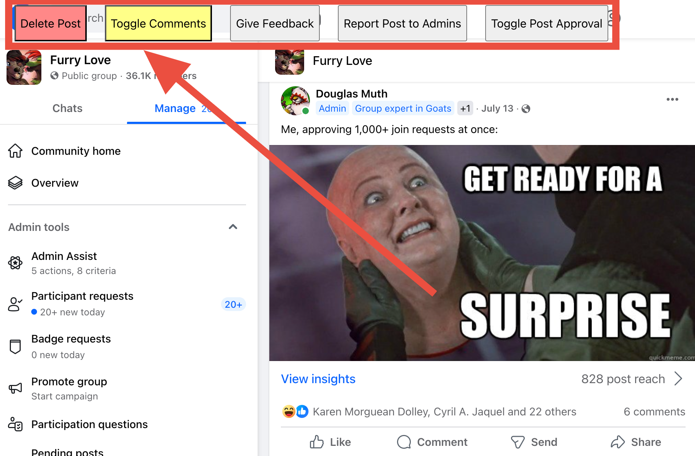

# Facebook Javascript Toolbox

Javascript helper tools for Facebook groups that I run.

## FB Group Tools
I wrote this [for a group that I run](https://www.facebook.com/groups/FurriesInLove/) which happens to have over 30,000 members, and substantial spam load.

[fb-group-tools.js](https://github.com/dmuth/facebook-javascript-toolbox/blob/main/fb-group-tools.js) - Adds buttons to "Give Feedback", "Report Post To Admins", and "Toggle Comments" in the upper left of Facebook groups.

## Contact Me

If you want to get in touch, [submit an issue](issues) or send me an email at **doug.muth AT gmail DOT com**.
